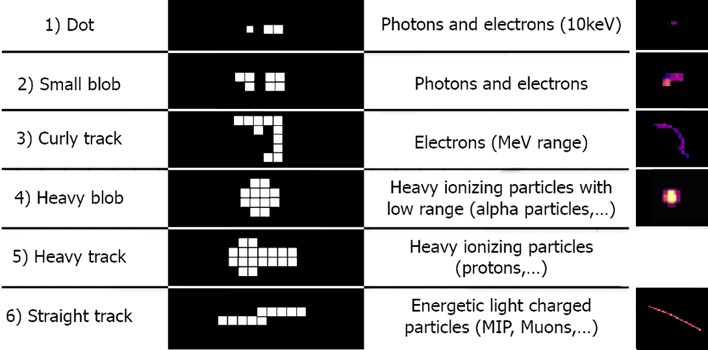

# Cluster

Le tracce lasciate da una particella incidente all’interno di un HPD possono avere dimensioni anche molto maggiori di un singolo pixel, dando origine a dei cluster (letteralmente ’grappoli’) di pixel. L’effetto di diffusione della carica elettrica attraverso vari pixel è chiamato effetto di condivisione di carica o *charge sharing effect*. Esso è uno dei fattori che influiscono sulla forma del cluster e dipende da varie condizioni, fra cui:

- ionizzazioni primarie e secondarie all’interno del semiconduttore;
- energia della radiazione incidente, che ne definisce il range;
- diffusione dei portatori di carica nel sensore;
- valore della tensione di polarizzazione applicata: maggiore è il campo elettrico generato dal bias voltage, maggiore è la sua compensazione all’allargamento della nube di coppie elettrone-lacuna che si forma nel semiconduttore.

L’effetto charge sharing è vantaggioso perché permette di identificare il tipo di particella incidente in base alla forma del cluster che essa crea nel detector. A seguito di una ricostruzione del cluster è possibile ottenere molte informazioni sulla particella incidente; in particolare si possono ricavare le dimensioni del cluster, definite dal numero di pixel che lo compongono, e l’energia della particella incidente, sommando le cariche raccolte in ogni pixel e convertendo il valore così ottenuto in energia.

## Matrice ASCII

Una matrice ASCII è una matrice di numeri composta da m righe e n colonne (nel caso del sensore Medipix 256 righe e 256 colonne), in cui ogni elemento di matrice rappresenta un pixel e l’entrata numerica di tale elemento rappresenta il valore del pixel. Questa matrice può essere convertita in un plot bidimensionale (in inglese *raster plot*) in cui ogni pixel è colorato diversamente a seconda del suo valore.

Dopo aver caricato i pacchetti necessari all’analisi dati, il file, che si presenta in formato .txt, viene aperto in R  antenendo la formattazione originale, ovvero come una matrice 256 × 256.
Tale matrice viene poi convertita in formato raster e si definiscono le dimensioni del plot. Se necessario si esegue un clamping dei dati, ovvero si impostano delle soglie minime e massime per i valori dei pixel, in modo da migliorare la visibilità del plot stesso.
Infine è possibile scegliere la mappa colori (che definisce appunto i colori dei pixel), visualizzare il plot ed esportarlo in formato immagine.

*Esempio di matrice ASCII e relativo output*
## .CLOG file

I file in formato .CLOG  (**Cluster LOGs**) forniscono non solo le informazioni sui singoli pixel, ma permettono anche di ricostruire i cluster e di produrre spettri energetici e raster plot. 
Un file in questo formato è organizzato secondo questa logica:
- ogni pixel è rappresentato da tre valori fra parentesi quadre, che ne indicano l’ascissa, l’ordinata ed il valore energetico: [X, Y, Energia];
- sono registrati solo i pixel con valori di energia non nulli;
- pixel nella stessa riga fanno parte di uno stesso cluster;
- ogni riga nel file rappresenta un cluster distinto;
- ogni frame è separato dal successivo da uno spazio; inoltre prima di ciascuno di essi è presente una riga con le informazioni del frame stesso, quali numero del frame e tempo d’acquisizione.

*Esempio di Cluster LOG e relativo output*

Il primo passo nell’analisi è rimuovere ogni riga contenente le informazioni dei cluster, eliminare le parentesi quadre e sostituire le virgole con degli spazi. Questo processo non va eseguito in R, bensì può essere svolto in un qualsiasi editor testuale. Inoltre, sebbene il formato Cluster LOGs sia visualizzabile come file di testo, è necessario salvarlo in formato
.txt per poter eseguire correttamente lo script di analisi.

Dopo aver caricato i pacchetti necessari, il file viene aperto in R sotto forma di tabella con 768 colonne (3 × 256): ciò assicura che anche tracce molto lunghe vengano correttamente riconosciute come parte di un singolo cluster.
Si procede poi ad isolare i valori X, Y e di energia, mantenendo comunque le separazioni fra righe (quindi fra cluster); se necessario
si selezionano solo i valori di energia sotto una particolare soglia.

Per realizzare il raster plot si isolano i dati di un singolo frame i quali, dopo un eventuale clamping dei valori di energia, vengono automaticamente convertiti in formato raster tramite una funzione di R. Dopo aver fatto ciò si definiscono le dimensioni del plot, la mappa colori ed infine si può procedere ad esportare il grafico in formato .png.

Per realizzare gli spettri invece vengono utilizzati tutti i dati di un’acquisizione, comprendendo perciò tutti i frame, in modo da aumentare la significatività statistica.
Dai valori di energia è possibile generare l’istogramma che rappresenta lo spettro energetico per pixel, modificarne i parametri quali la larghezza delle classi di frequenza ed il range di visualizzazione, ed infine salvarlo in formato immagine.
In seguito vengono sommati i valori di energia per ogni riga, ovvero le energie di tutti i pixel in un cluster, ottenendo quindi il valore dell’energia totale del cluster; è perciò possibile generare lo spettro energetico per cluster, modificarne i parametri ed esportarlo.
Infine si conta il numero di pixel per cluster, che rappresenta le dimensioni dei cluster; anche per questo
istogramma è possibile modificare il range di visualizzazione ed infine esportarlo.